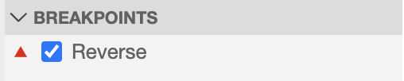

# Getting Started with Your IDE

This tutorial will teach you the basics of writing Go code in your IDE.
We will cover structuring your project, writing a function, and testing
and debugging your code.

## Creating your project

### Initializing a module

Let's start by creating a module, which is the unit that defines a Go project.
We can do this through a command, which we can run from the Command Palette. Access the Command Palette by going to the View Menu and selecting "Find Command", or by using the `Ctrl+Shift+P` keyboard shortcut.

<!--Note: This doesn't work yet, because Cloud Shell IDE uses an older version of VS Code Go.-->
Select the `Go: Initialize go.mod` command by typing in the search bar. Enter the module name `example.com` when prompted. Notice that this creates 2 new files in the repository:
<walkthrough-editor-spotlight spotlightId="navigator" spotlightItem="cloudshell_open/go-tutorials/example.com/go.mod">`example.com/go.mod`</walkthrough-editor-spotlight>
and <walkthrough-editor-spotlight spotlightId="navigator" spotlightItem="cloudshell_open/go-tutorials/example.com/go.sum">`example.com/go.sum`</walkthrough-editor-spotlight>.
You can largely disregard the `go.sum` file, but you will refer to the `go.mod` file as you edit your Go project. Let's take a look at it.

### Understanding the `go.mod` file

Let's open the <walkthrough-editor-open-file filePath="cloudshell_open/go-tutorials/example.com/go.mod">`go.mod`</walkthrough-editor-open-file> file for the project.

This is the file defines our project and its dependencies. We are working in the <walkthrough-editor-select-regex filePath="cloudshell_open/go-tutorials/example.com/go.mod" regex='example.com'>`example.com` module</walkthrough-editor-select-regex>, and it is compatible with 
<walkthrough-editor-select-regex filePath="cloudshell_open/go-tutorials/example.com/go.mod" regex='go \d.\d+'>
Go version 1.16
</walkthrough-editor-select-regex>. Note that the Go version declared in the `go.mod` file is not necessarily the Go version you must use--it is the lowest supported version of Go for that module. You can check your current Go version by looking at the Go status bar item in the lower left-hand corner of the editor. <!--Would be nice to highlight the status bar item.-->

### Tidying your module

The `go.mod` file declares the third-party dependencies for the module, and we keep it up to date by tidying our module. The sample project already uses a third-party dependency in the Go code, so let's tidy the module now.

Click the `Run go mod tidy` code lens at the top of the file. <!--Would be nice to highlight the code lens.-->

Once the module is tidied, you will see that the
<walkthrough-editor-select-regex filePath="cloudshell_open/go-tutorials/example.com/go.mod" regex='rsc.io/quote'>`rsc.io/quote` module</walkthrough-editor-select-regex> has been added as a requirement to the `go.mod` file.
This is because a <walkthrough-editor-open-file filePath="cloudshell_open/go-tutorials/example.com/stringutil/quote.go">file in the `stringutil`
</walkthrough-editor-open-file>
package depends on this module already. The <walkthrough-editor-open-file filePath="cloudshell_open/go-tutorials/example.com/go.sum">`go.sum` file</walkthrough-editor-open-file> will also have a corresponding update.

Finally, notice that the additional code lenses now visible in the `go.mod` file. You can use these code lenses to upgrade your dependencies from the editor, without using the command-line.

## Let's start writing some Go code

We're going to work on a function to reverse the contents of the file. Let's take a glance at our test case, which  you can see in
<walkthrough-editor-open-file filePath="cloudshell_open/go-tutorials/hello.txt">the `hello.txt` file
</walkthrough-editor-open-file>.

We already seem to have some string utilities in our module, so let's search for a useful helper function.

### Symbol search

Let's start off by doing a workspace symbol search. Open the Command Palette by going to the View Menu
and selecting "Find Command", or by using the `Ctrl+Shift+P` keyboard shortcut.

Delete the `>` character in the box. That character indicates that you will search for available commands. Instead, type the `#` symbol to indicate that you are doing a workspace symbol search. (You can use the `@` symbol to search for symbols in the current file.) Now, type your search keyword. In this case, it is "reverse".

Select the first result. It should take you to the 
<walkthrough-editor-select-regex filePath="cloudshell_open/go-tutorials/example.com/stringutil/reverse.go" regex='Reverse'>
definition of the `Reverse` function</walkthrough-editor-select-regex> in the <walkthrough-editor-open-file filePath="cloudshell_open/go-tutorials/example.com/stringutil/reverse.go">`reverse.go`</walkthrough-editor-open-file> file. We will use this helper function to write our own `ReverseFile` function.

### Implementing `ReverseFile`

Let's write a new function, which we will call `ReverseFile`.

Paste the following function signature below `Reverse` in <walkthrough-editor-open-file filePath="cloudshell_open/go-tutorials/example.com/stringutil/reverse.go">`reverse.go`</walkthrough-editor-open-file>:


```go
// ReverseFile reverses the content of a file.
func ReverseFile(filename string) (string, error) {}
```

In the body of the function, start writing out:


```go
content, err := os.
```

Completion results should pop up. Hover over the `ReadFile` option. You can read the function's documentation by pressing `Ctrl+Space`. Hit `Enter` and accept the completion result. Notice that <walkthrough-editor-select-regex filePath="cloudshell_open/go-tutorials/example.com/stringutil/reverse.go" regex='import "os"'>the `os` package</walkthrough-editor-select-regex> was imported automatically when you accepted the completion. Pass `filename` as an argument to `ReadFile`. Your code should now look like:

```go
content, err := os.ReadFile(filename)
```

You should see some red squiggles, indicating errors in your code. Explanations for the errors should appear as you hover over them, or you can toggle the Problems view via the Command Palette.

We'll handle the `err` variable first.
<!--The following requires that placeholders are enabled.-->
Trigger a completion on the next line by pressing `Ctrl+Space`. You should see a completion result that says `if err != nil { return err }`. Accept the completion result, and it will add error handling.

Finally, use the `Reverse` function to reverse the file content. Below the error handling, type `return Reverse(`.
Trigger an autocompletion (`Ctrl+Space`) and select `content` from the completion list. The editor will add the appropriate case to convert `content` from a byte slice to a string.

<!--TODO(rstambler): Use a quickfix to add this return.-->
Finally add `nil` as the second return.

Your function should now look like this:

```go
// ReverseFile reverses the content of a file.
func ReverseFile(filename string) (string, error) {
    content, err := os.ReadFile(filename)
    if err != nil {
        return "", err
    }
    return Reverse(content), nil
}
```

## Test your function

### Generating a unit test

### Adding test cases

### `Run test` vs. `debug test`

## Debugging your test

### Setting Breakpoints

Let's set a breakpoint on `Reverse`. We could navigate back to the file and set a breakpoint on the location where we defined the function, or we can set the breakpoint by using the function name.

Open the <walkthrough-editor-spotlight spotlightId="activity-bar-debug">debug</walkthrough-editor-spotlight> view. Click the (`+`) icon in the `BREAKPOINTS` section to add a function breakpoint.


Type in `Reverse` in the input box and hit `OK`. The new breakpoint should now appear in the breakpoints section of the debug view.


